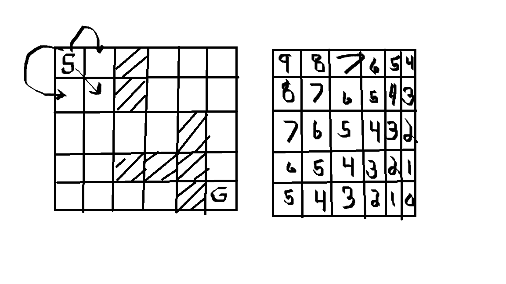

# Build an OpenStreet Route Planner

This project tasked me with designing an OpenStreet Route Planner using A* Search! 

This algorithm is used to find the shortest path between two points on a map. 

How would we develop this algorithm in c++?

The pseudocode is shown below 

## Pseudocode  

source: Udacity C++ Nanodegree Program

Search( grid, initial_point, goal_point ) :

Initialize an empty list of open nodes.

Initialize a starting node with the following:

x and y values given by initial_point.
g = 0, where g is the cost for each move.
h given by the heuristic function (a function of the current coordinates and the goal).
Add the new node to the list of open nodes.

while the list of open nodes is nonempty:

Sort the open list by f-value
Pop the optimal cell (called the current cell).
Mark the cell's coordinates in the grid as part of the path.
if the current cell is the goal cell:

return the grid.
else, expand the search to the current node's neighbors. This includes the following steps:

Check each neighbor cell in the grid to ensure that the cell is empty: it hasn't been closed and is not an obstacle.
If the cell is empty, compute the cost (g value) and the heuristic, and add to the list of open nodes.
Mark the cell as closed.
If you exit the while loop because the list of open nodes is empty, you have run out of new nodes to explore and haven't found a path

Here is what that looks like graphically 

## Graphic representation 

 

You start from the goal state and then choose the cell which minimizes the following function 

f = g + h(x,y) 

The heuristic is a follows 

h(x,y) <= Distance to goal from x,y

## Code breakdown

Since I am new to C++, I am going to take a different approach to this github. Rather than restrict myself to just showing how to run the project, I want to prove to myself that I am understanding what is going on in the code. Below, I will break down the code and try and explain what is going on. I had to have a lot of help from some smart people on the udacity forums to finish this project. I need to be able to accurately describe the setup of the code and relate it to the pseudocode above. 

### First task : Start and end coordinates

The first todo tasked me with initilizing a start and end coordinate pair. This was pretty simple. I just had to initialize four float variables and then used cin to accept keyboard input values. However, there is an issue. There is no "sanity check" as my grader pointed out. I would need to use a while loop to curb inputs to a value between 0 and 100.

### Second task : Find closest nodes

The second todo tasked me with finding the nodes closest to the coordinates given in the first task. The function was called RoutePlanner::RoutePlanner and took in a reference and two floats as parameters.  I had to generate references to the m_model object of type RouteModel and then apply the Find ClosestNode method. The reference prevents excess memory bloat by only having the methods acting on the same object without making extra copies. 

The ClosestNode Method takes in the x and y coordinate, imparts the values to the node variable called input. It then instantiates a min_dist variable using a numeric limits template, a dist variable of type float and an int closest_idx variable. It then loops through the Roads() and makes sure that it isn't a footway. It then goes through all node indices and checks if the distance is less than min dist. If it is, set closest_idx = node_idx and then min_dist = dist. 

### Third Task : Calculate the H Value 
Now we need to calculate the distance to the end node from the node given as an argument. The function is called RoutePlanner::CalculateHValue and took in a const pointer parameter of type RouteModel::Node. To be terribly honest, I didn't really question why a pointer was used here. I had a shaky appreciation for pointers during this program. After doing some more research, I think this pointer is useful because you can access this data from multiple locations in the program. I guess it makes the program more compact.... Its const because you are not going to redefine it after instantiation. Either way, it was necessary to access the underlying distance method. Since its a pointer you need to use '->' and then apply it to another pointer to the end node. 

### Fourth Task : Add Neighbors

If the cell we are in is not the goal cell, we need to search the surrounding cells to advance to the desired location. The function that needed to be completed was the RoutePlanner::AddNeighbors(). It took a pointer to a parameter called current_node. I remember using multiple sources from the knowledge forum to finish this particular code portion. So the first thing we need to do is use the FindNeighbors() Method to poulate the current_node.neighbors vector. Need to dereference to access underlying method. 

The FindNeighbors() method uses a for loop to investigate each road in the array. It then creates a new neighbor pointer which then is added through emplace_back into the neighbors vector. 

So now that the neighbors array is populated we need to loop through each node entry. These will be pointers. The node in each for loop pass will have its parent attribute, g_value and h_value attributes established. It will then be put into the open_list through emplace_back. the visited attribute will also be set to true. 

### Fifth Task : Next Node Method

Now we need to find ways of comparing cells to see which route needs to be taken. First the boolean compare function needs to be created. The compare function takes two const pointers as parameters. I needed to dereference the inputs to access the underlying g_value and h_value attributes and then generate the f values for each node. I then needed to see which f value was smallest. The smallest value would be the ideal pathway. 

This was then used in the NextNode Method where the open_list would be sorted using the compare method as the critieria. Then I needed to get the lowest sum from the back of the list. The entry was removed and then the sum was returned as a pointer. 

### Sixth Task : Construct Final Path 

Now it is necessary to find the final path, I needed to finish the RoutePlanner::ConstructFinalPath() Method. It takes the pointer to a current_node which starts off as the final goal state. A while loop needed to be created with the condition that as long as the start node is not equal to the current node, the loop would continue to execute. Each loop the distance would be calculuated by dereferencing the pointer and accessing its distance method. The input would be the parent attribute of that node. This node would then be saved into the path found vector through push_back. The parent node of the initial node will then be set to the current node. This will then cascade until the start state is reached. 

### Seventh Task : A star search 

We have all of the steps we need to perform the final path search. Initialize a null pointer and then initialize a current node. Need to set the visited attribute of the current node to true. Apply the AddNeighbors() method with the current node as input. add the nodes found to the open list.  Now we need to advance to the next node that is the best choice. This is done through the NextNode() Method. Then we need to find the neighbors of that node and search with NextNode() method until the start state is reached. Then the final path is returned. 

## Start of Project


## Cloning

When cloning this project, be sure to use the `--recurse-submodules` flag. Using HTTPS:
```
git clone https://github.com/udacity/CppND-Route-Planning-Project.git --recurse-submodules
```
or with SSH:
```
git clone git@github.com:udacity/CppND-Route-Planning-Project.git --recurse-submodules
```

## Dependencies for Running Locally
* cmake >= 3.11.3
  * All OSes: [click here for installation instructions](https://cmake.org/install/)
* make >= 4.1 (Linux, Mac), 3.81 (Windows)
  * Linux: make is installed by default on most Linux distros
  * Mac: [install Xcode command line tools to get make](https://developer.apple.com/xcode/features/)
  * Windows: [Click here for installation instructions](http://gnuwin32.sourceforge.net/packages/make.htm)
* gcc/g++ >= 7.4.0
  * Linux: gcc / g++ is installed by default on most Linux distros
  * Mac: same instructions as make - [install Xcode command line tools](https://developer.apple.com/xcode/features/)
  * Windows: recommend using [MinGW](http://www.mingw.org/)
* IO2D
  * Installation instructions for all operating systems can be found [here](https://github.com/cpp-io2d/P0267_RefImpl/blob/master/BUILDING.md)
  * This library must be built in a place where CMake `find_package` will be able to find it

## Compiling and Running

### Compiling
To compile the project, first, create a `build` directory and change to that directory:
```
mkdir build && cd build
```
From within the `build` directory, then run `cmake` and `make` as follows:
```
cmake ..
make
```
### Running
The executable will be placed in the `build` directory. From within `build`, you can run the project as follows:
```
./OSM_A_star_search
```
Or to specify a map file:
```
./OSM_A_star_search -f ../<your_osm_file.osm>
```

## Testing

The testing executable is also placed in the `build` directory. From within `build`, you can run the unit tests as follows:
```
./test
```
